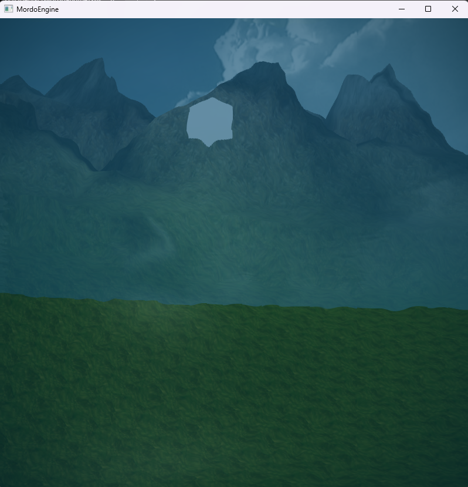

# MordoEngine

A real-time 3D engine written from scratch in C++ and OpenGL, and the game being
built on top of it.

Large-scale terrain with dynamic level of detail, water with planar reflection and
refraction, skeletal animation loaded from Blender exports, and an actor layer with
raycast collision.

`C++20` · `OpenGL 3.3` · `GLSL` · `Assimp` · `GLM` · `GLFW` · `glad` · `stb_image`


---

## Features

**Terrain**
- Heightmap (263k vertices) split into 256 patches, loaded from `uint16` RAW
- **Geomipmapping**: per-patch LOD chosen by camera distance, with edge stitching
  against neighbouring patches so no cracks appear between levels
- Three generators behind one interface: heightmap, fault formation and midpoint
  displacement
- Height-based texture splatting (grass → dirt → rock) with smooth blending
- Smooth per-vertex normals computed on build

**Water**
- Planar **reflection** and **refraction** into two framebuffers, by mirroring the
  camera across the water plane and clipping each half with `GL_CLIP_DISTANCE0`
- DuDv map distortion and a **Fresnel** term, so the surface goes from refractive
  underfoot to reflective at grazing angles
- Underwater post-process that only runs while the camera is submerged, with the
  surface drawn from below as a translucent sheet that does not write depth

**Models and animation**
- glTF loading through Assimp, with post-processing flags chosen **per file**:
  static models get their node hierarchy baked and their submeshes merged, animated
  ones keep the hierarchy the animation drives
- **Skeletal animation** with GPU skinning, up to 4 bone influences per vertex and
  100 bones per model, plus rigid-node animation for pieces that move without a skeleton
- Node globals resolved in a **single forward pass** — the loader flattens the tree
  depth first, so a parent always precedes its children and no recursion is needed
  per frame
- Named clips, looping and non-looping playback, and per-instance time offsets
- Asset/instance split: a `Model` (GPU buffers, textures, rig) is shared by every
  copy, while a `Body` (the animator) belongs to one actor — three animated
  characters cost one set of buffers plus one pose each

**Actors, physics and lighting**
- `Actor` base type with an `ActorSystem` that updates, draws and destroys, and an
  interaction path (`Interact`) that keeps input out of the actor layer
- Box and sphere colliders behind one abstract interface; **ray–AABB** intersection
  by the slab method, run in the actor's local space so it stays exact under
  rotation and scale
- Broad phase (AABB overlap) and narrow phase (exact raycast) kept separate, with
  collision layer masks filtering before any geometry is touched
- Colliders fitted automatically to the model's own bounds, measured at load
- One directional light following the time of day, plus up to 16 point lights that
  can be switched on and off individually
- Cubemap skybox

**Tooling**
- Terrain editor scene with a brush that raises and lowers terrain, adjustable
  radius and strength, and a circular selector drawn on the surface
- Only the vertices the brush touched are re-uploaded to the GPU, not the whole mesh
- `F3` collision debug view: every collider, the one under the crosshair, and where
  the aim ray landed

---

## Gallery

| | |
|---|---|
|  <br> Terrain with distance-based LOD and height splatting |  <br> Terrain editor: brush selector projected on the surface |
|  <br> Point light with attenuation, under the cubemap sky |  <br> Underwater post-process |

More, in date order, in [`imgs/`](imgs/) — the project's whole visual history.

---

## Architecture

Every subsystem follows the same three-layer split:

```
data / technique   no OpenGL at all — can be compiled and exercised with no window
       ↓
renderer           owns the VAO/VBO/EBO and issues the draw calls
       ↓
system             drives both and owns the material uniforms
```

Terrain is `Terrain` + `Geomipmapping` → `TerrainMeshRenderer` → `TerrainSystem`.
Models are `ModelLoader` → `ModelRenderer` → `ModelSystem`. The practical payoff:
`ModelLoader` does not link against OpenGL, so a `.gltf` can be verified — bone
counts, weight sums, clip durations — without creating a context.

The model pipeline end to end:

```
Blender  →  res/models/<name>/<name>.gltf
              ↓  ModelLoader        (Assimp → CPU data, not one GL call)
            ModelData
              ↓  ModelRenderer      (VAO/VBO/EBO, emits MeshDrawCall)
            Model                   (mesh + materials + rig — shared by everyone)
              ↓  Body               (one per actor: the model it borrows + its own Animator)
            Actor                   (where it is, and what it does)
              ↓  ModelSystem        (per-pass uniforms, then one draw per body)
            World::RenderOpaque
```

Two more decisions worth knowing about:

- **`RenderContext`** carries every matrix, the camera position and the clip plane
  through the whole render path, so the water passes derive their own context by
  copying and overriding one field instead of threading nullable pointers around.
- **`World::RenderOpaque` runs three times per frame** (reflection, refraction,
  screen). Anything placed there is paid for three times, which is why gameplay and
  animation live in `Update` and never in a render path.

---

## Build

**Requirements:** Visual Studio 2022 (MSVC v143), Windows, x64. Every dependency is
vendored under `MordoEngine/vendor/`, so there is nothing to install.

```
git clone https://github.com/PaulStna/MordoEngine.git
```

Open `MordoEngine.sln`, pick `Debug|x64` or `Release|x64`, and build. A post-build
step copies the Assimp DLL next to the executable.

> **Working directory.** Assets are resolved relative to the current directory, so
> the executable must run with `MordoEngine/` (the project folder containing `res/`)
> as its working directory. That is Visual Studio's default when you run with F5.

---

## Controls

**Anywhere**

| Key | |
|---|---|
| `Esc` | Quit |
| `Space` | Toggle wireframe |
| `G` / `E` | Switch to the game scene / the terrain editor |

**Game scene**

| Key | |
|---|---|
| `W` `A` `S` `D` | Move — the camera stays glued to the terrain |
| Mouse | Look |
| Left click | Interact with whatever is under the crosshair |
| `F3` | Toggle the collision debug view |

**Editor scene**

| Key | |
|---|---|
| `W` `A` `S` `D` + Mouse | Free-fly camera |
| Left click / Right click | Raise / lower terrain under the selector |
| `J` / `K` | Grow / shrink the selector |
| `N` / `M` | Increase / decrease brush strength |
| `O` | Save the terrain |

---

## Documentation

**The conventions this codebase is held to**

- **[C++ style](docs/cpp-style.md)** — naming, formatting, what earns a comment
  and what does not, the ownership rules, and the architecture rules that break
  the engine when they are ignored
- **[Architecture](docs/architecture.md)** — the three-way split every subsystem
  follows, the context structs, the ownership patterns, and the checklist for
  adding a new subsystem
- **[Documenting code](docs/documenting-code.md)** — the `///` rules that reach
  Visual Studio's Quick Info, when a `@param` earns its line, and worked
  before/after examples

**Working with the engine**

- **[Loading Blender models](docs/loading-blender-models.md)** — exporting from
  Blender, the two conventions that bite, what each piece of the pipeline does, and
  how to get a model into the scene
- **[Model animation](docs/model-animation.md)** — what the engine animates and what
  it does not, why the loader picks its Assimp flags per file, how the `Rig`/`Animator`
  split works, and a symptom→cause table for when a skeleton misbehaves
- **[Changelog](docs/changelog.md)** — every day of work since January 2026, with the
  reasoning behind the refactors

---

## Layout

```
MordoEngine/src/
├── API/OpenGL/     window, context and GL entry points
├── Actor/          Actor, ActorSystem, and the actor types (player, light, animal)
├── Camera/         quaternion camera
├── Core/           Math, Model (loading, animation), Resources, Shader, Texture, Transform
├── Input/          keyboard and mouse, the only place GLFW is read
├── Lighting/       directional and point lights
├── Physics/        colliders, collision layers
├── Renderer/       everything that owns GPU buffers and draws
├── Scene/          game scene, editor scene, scene manager
├── Sky/  Terrain/  Water/    the world's systems
└── World/          what every scene shares
```

---

## Not implemented (yet)

Kept explicit, because knowing where the edges are matters as much as knowing what
works:

- **Morph target animation** (Blender shape keys) — needs per-vertex blending rather
  than node transforms, so it is a separate path, not another case of the existing one
- **Blending between animation clips** — switching is a hard cut; the change is
  contained entirely inside `Animator`
- **Frustum culling** and **shadow mapping**
- **A broad-phase structure for collision** — queries are a linear scan over the
  actors, which is honest at this scale and is exactly the piece a grid or BVH
  replaces later without any caller changing

---